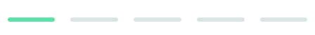

# FAQ Accordion 💬

#### Level: Newbie  

## Technologies Required 💻

1. HTML
2. CSS (responsive design)
3. JS (Vanilla JS)

## CSS Variables 🖌

#### Colors Text

1. --very-dark-desatured-blue: hsl(300, 43%, 22%)
2. --soft-red: hsl(14, 88%, 65%)

### Gradient

1. --soft-violet: hsl(273, 75%, 66%)
2. --soft-blue: hsl(240, 73%, 65%)

---

### Neutral Text Colors

1. --very-dark-grayish-blue: hsl(237, 12%, 33%)
2. --dark-grayish-blue: hsl(240, 6%, 50%)

---

### Dividers

1. --light-grayish-blue: hsl(240, 5%, 91%)

### Body Copy

1. $font-size: 12px

--- 

### Font

1. Family: [Kumbh Sans](https://fonts.google.com/specimen/Kumbh+Sansps://fonts.google.com/speciment/Spartan)
2. Weights: 400, 700

---

## What is it about? 🤔

This is the second project in a long series of front-end projects that are part of the [FrontendMentor](https://www.frontendmentor.io/challenges) challenges.
